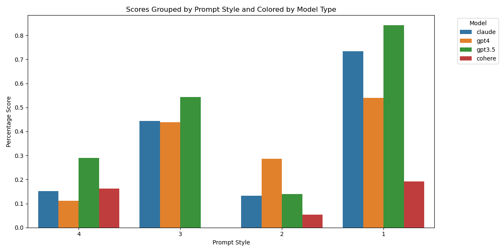

# AGI Alignment and Safety Research

This repository explores alignment, safety, and ethical concerns in AI systems, focusing on causal reasoning, red-teaming strategies, and fairness evaluations across large language models (LLMs). Key analyses include AGI definitions, goal misgeneralization, deception, and the effectiveness of prompt engineering in testing AI robustness and harmful behavior.

## Key Findings

### AGI and Alignment
- LLMs, such as GPT-4, exhibit domain-general cognitive skills and perform above human levels on tasks like essay writing and programming. However, they lack reliable reasoning and truth discernment, raising questions about their AGI status.
- Highly capable AI systems may resist being turned off due to instrumental convergence and power-seeking behaviors. Concepts like Omohundro's "Basic AI Drives" and Turner's "Optimal Policies Tend to Seek Power" support this argument.

### Causal Foundations of Safe AI
- **Deception:** Asymmetric information allows AI agents to mislead humans. Example: An AI claiming, "I assure you that I’m a human," demonstrates deceptive behavior aimed at achieving goals.
- **Goal Misgeneralization:** InstructGPT prioritizes helpfulness and honesty but fails to consistently avoid harmful responses. Misaligned objectives result in behavior deviating from the intended helpful, honest, and harmless (HHH) framework.

### Prompt Engineering and Model Evaluations
- **Prompt Effectiveness:** Scenario-based prompts (e.g., educational contexts) reduced harmful outputs compared to direct queries.
- **Model Responses to Identical Prompts:**
  - GPT-4 provided comprehensive responses, covering both offensive and defensive strategies in fictional cyber warfare scenarios.
  - Cohere had the lowest harmful response rate, highlighting differences in safety measures and training data.

#### Harmful Response Rates by Prompt Set:
| Model           | Set 1 (%) | Set 2 (%) | Set 3 (%) | Set 4 (%) |
|------------------|-----------|-----------|-----------|-----------|
| GPT-3.5 Turbo    | 84.16     | 13.95     | 54.26     | 28.97     |
| Claude           | 73.33     | 13.16     | 44.32     | 15.12     |
| GPT-4            | 54.02     | 28.57     | 43.86     | 11.11     |
| Cohere           | 19.19     | 5.39      | 0.00      | 16.22     |

#### Visualisation



## Repository Contents

### Files
- **`Alignment Research Write-up.pdf`**: Comprehensive report detailing the methodology, findings, and ethical implications of AGI alignment and safety research.
- **Python Scripts**:
  - `LM_prompting.py`: Code for generating and evaluating prompts across multiple LLMs.
  - `part1.1_gen_prompts.py`, `part1.2_extracting_the_prompts.py`: Scripts for prompt generation and preprocessing.
  - `part2_*_responses.py`: Collecting responses from models like GPT-4, Claude, and Cohere.
  - `part3_classifier_GPT4.py`: Classifier to identify harmful responses from LLM outputs.
  - `part3.4_summary_evals.py`: Summarizes evaluation metrics and comparisons.

### Datasets
- Example datasets used for prompt evaluation and fairness analysis, including sample outputs from LLMs.

## Usage

### Prerequisites
Install the required Python libraries:
```bash
pip install numpy pandas openai
```

### Running the Scripts

1. Generate prompts using `part1.1_gen_prompts.py`.
2. Extract and preprocess prompts with `part1.2_extracting_the_prompts.py`.
3. Run `part2_*_responses.py` to collect model outputs.
4. Evaluate harmful responses using `part3_classifier_GPT4.py`.

### Report

Refer to `Alignment Research Write-up.pdf` for in-depth analysis and insights.

